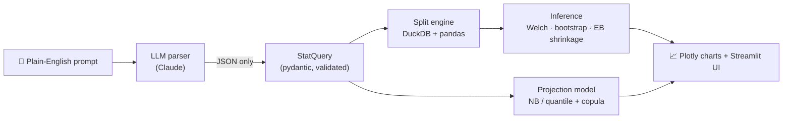

# NBA Stat Lab


**Ask a plain-English question about any NBA player or team since 1996. Get the stat split, a significance test, charts, and a calibrated over/under projection. The LLM does no math.**

🔗 **Live demo:** _coming soon_ &nbsp;·&nbsp; 📊 **Model report:** [`docs/model_report.md`](docs/model_report.md) _(pending)_


<!-- TODO: record docs/img/demo.gif of the app answering "What's Steph Curry's apg against the Spurs?" -->

---

## What it does

| You ask | You get |
|---|---|
| *"What's Steph Curry's apg against the Spurs?"* | Split vs. career baseline, sample size, Welch p-value, bootstrap CI, and a shrunk estimate for small samples |
| *"How does Curry score against 6'6"–6'8" defenders?"* | The same split through on-court defender data, with each proxy labeled by source |
| *"Will LeBron go over 25.5 points tonight?"* | P(over/under), plus 90 / 95 / 99% prediction intervals |

<!-- TODO: add screenshots once the Streamlit app is built -->
| Split vs. baseline | Defender split | Projection |
|---|---|---|
|  |  |  |

## How it works



**Core rule:** the LLM only turns the question into a typed `StatQuery`. Name matching runs in our own code. Every number comes from deterministic, unit-tested Python.

## Data science highlights

- **Leakage-free rolling features.** Rolling averages are shifted one game within each player, so a row never sees its own game. Tests check that no row sees its own game or another player's games. Team ratings are cumulative *pre-game* values, and rest and calendar features are known before tip-off.
- **Empirical Bayes shrinkage.** Split means are pulled toward the baseline by `n / (n + σ²/τ²)`. τ² is estimated from how much real between-split variation exists, so a 12-game "vs. Spurs" split isn't taken at face value.
- **Valid significance tests.** Welch's t-test and a bootstrap CI compare the split against the *rest* of the baseline, not against a baseline that contains the split.
- **Distribution-aware projections.** Negative binomial models handle over-dispersed counts (assists, rebounds, 3PM), and quantile models give the intervals. *(in progress)*
- **Joint probabilities via Gaussian copula.** 10k Monte Carlo draws from the fitted marginals, linked by the player's residual correlations (e.g. P(25+ pts **and** 8+ ast)). *(in progress)*
- **Time-based backtest.** Train on earlier seasons, test on later ones, never shuffled. *(in progress)*

  | Metric | Result |
  |---|---|
  | Points MAE (model vs. rolling-average baseline) | `TBD` vs `TBD` |
  | Brier score, over/under (model vs. baseline) | `TBD` vs `TBD` |
  | Interval coverage (nominal 90 / 95 / 99%) | `TBD` / `TBD` / `TBD` |

- **Serious data cleaning.** 1.67M player rows, 18.7M play-by-play events, and 80 seasons of data. The pipeline normalizes 10 messy `gameType` labels through gameId encoding, recovers 100% of 105k missing team ids, and handles franchise moves by `teamId` (two different "Hornets"!). See [`docs/data_profile.md`](docs/data_profile.md).

## Limitations

- **Box scores don't record who guarded whom.** Defender splits use matchup data where it exists. Otherwise they fall back to on-court overlap or a same-position starter, and the UI always labels which source was used.
- **Small samples are the norm.** A player vs. one team is often 20–40 games. Sample size is always shown, and estimates are shrunk toward the baseline.
- **History ≠ destiny.** Projections can't account for injuries, lineup news, or anything after the data cutoff (June 2026; play-by-play ends before the 2026 playoffs).
- **Not betting advice.** Over/under lines are a way to express uncertainty. This is a portfolio project, not a wagering tool.

## Run it locally

```bash
uv sync                                   # Python 3.11 deps
.venv/bin/python -m nbalab.data.build     # raw CSVs -> data/processed/*.parquet
.venv/bin/python -m pytest                # test suite
```

Raw data (not included) goes in `data/raw/`. `ANTHROPIC_API_KEY` goes in `.env`.
