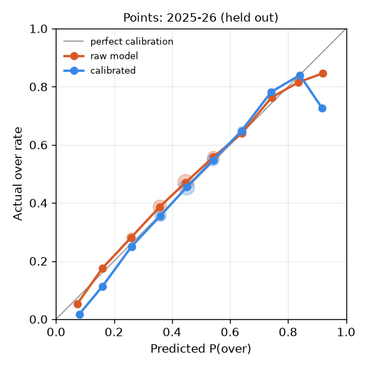
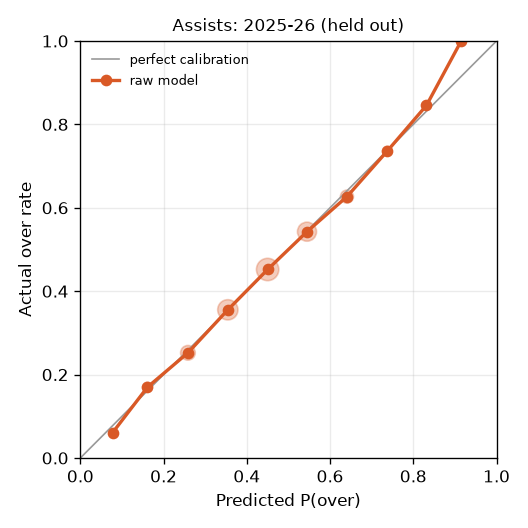
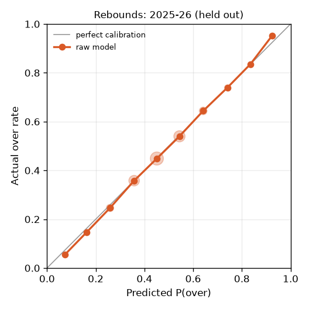
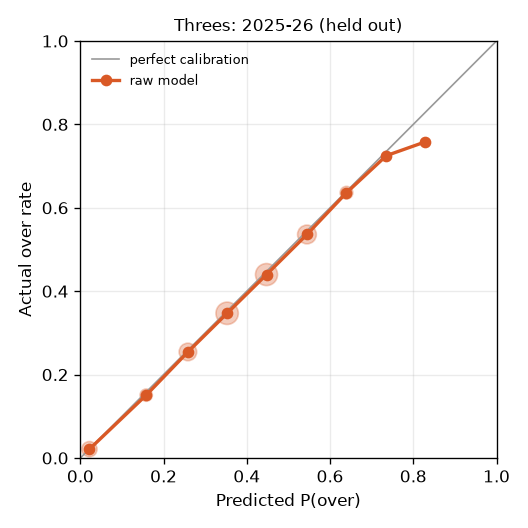
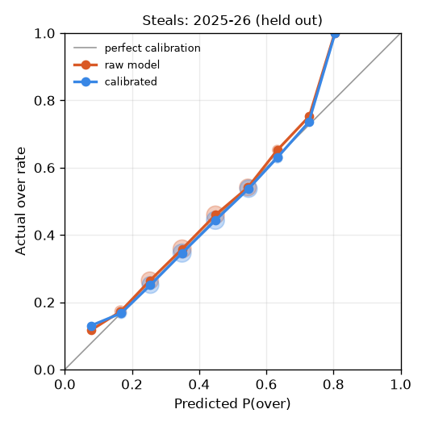
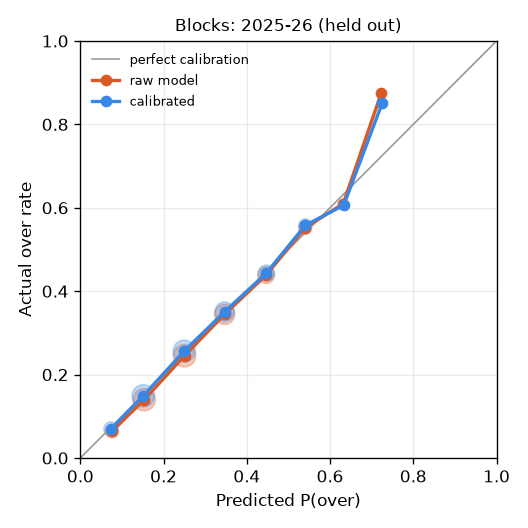
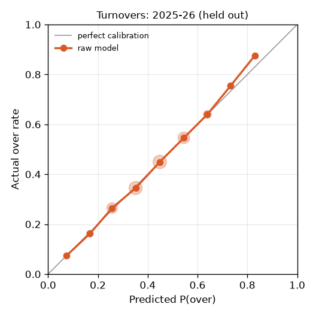
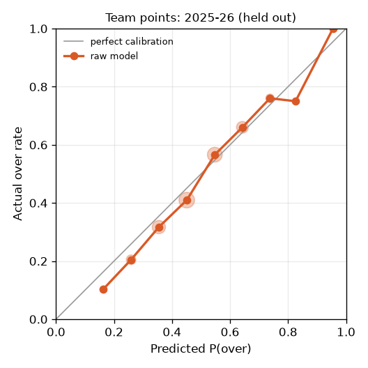

# Projection model report (v1.0.0-20260929)

Trained on 2012-13 through 2023-24. Model choices were made on 2023-24, held out from a fit on 2012-13 through 2022-23. Tested on 2024-25 and 2025-26, which the models never saw.

**No sportsbook lines exist in this dataset.** Every line below is synthetic: the player's pre-game season-to-date average (or last-10 average before 5 games) rounded to x.5, plus a whole-number version to test pushes. Real market lines are sharper, so these probability scores are a proxy for how the model would do against a market.

## Verdict

Main model = the model chosen per stat on the validation season. Baseline = recency-weighted average x opponent defensive rating x home factor, negative binomial. MAE difference is model minus baseline, with a 95% bootstrap CI that resamples whole players (negative = model better).

| Subject | Stat | Model | MAE vs baseline (95% CI) | Brier model / baseline | Log score model / baseline | Verdict |
|---|---|---|---|---|---|---|
| player | Points | lgbm | -0.111 [-0.124, -0.099] | 0.2354 / 0.2433 | -3.027 / -3.085 | beats baseline |
| player | Assists | lgbm | -0.031 [-0.035, -0.027] | 0.2295 / 0.2379 | -1.738 / -1.771 | beats baseline |
| player | Rebounds | lgbm | -0.052 [-0.059, -0.046] | 0.2323 / 0.2415 | -2.146 / -2.189 | beats baseline |
| player | Threes | lgbm | -0.016 [-0.019, -0.013] | 0.2037 / 0.2089 | -1.297 / -1.323 | beats baseline |
| player | Steals | lgbm | -0.007 [-0.009, -0.005] | 0.2225 / 0.2269 | -1.128 / -1.144 | beats baseline |
| player | Blocks | lgbm | +0.002 [+0.000, +0.004] | 0.1819 / 0.1842 | -0.803 / -0.812 | mixed |
| player | Turnovers | lgbm | -0.017 [-0.019, -0.013] | 0.2259 / 0.2345 | -1.351 / -1.380 | beats baseline |
| team | Team points | glm | -0.429 [-0.503, -0.363] | 0.2248 / 0.2379 | -3.887 / -3.936 | beats baseline |
| team | Assists | glm | -0.124 [-0.175, -0.073] | 0.2298 / 0.2393 | -2.992 / -3.023 | beats baseline |
| team | Rebounds | glm | -0.170 [-0.208, -0.136] | 0.2365 / 0.2456 | -3.278 / -3.307 | beats baseline |
| team | Threes | lgbm | -0.012 [-0.040, +0.019] | 0.2432 / 0.2450 | -2.721 / -2.731 | mixed (MAE gap within noise) |

## Point accuracy (MAE of the expected value)

| Stat | Season | Games | Main | Baseline | Last-10 avg | GLM | LightGBM | Quantile | Main - last-10 (95% CI) |
|---|---|---|---|---|---|---|---|---|---|
| Points | 2024 | 27608 | 4.560 | 4.664 | 4.749 | 4.585 | 4.560 | 4.646 | -0.189 [-0.212, -0.168] |
| Points | 2025 | 28204 | 4.492 | 4.610 | 4.678 | 4.518 | 4.492 | 4.575 | -0.186 [-0.209, -0.163] |
| Points | all | 55812 | 4.525 | 4.637 | 4.713 | 4.551 | 4.525 | 4.610 | -0.188 [-0.204, -0.172] |
| Assists | 2024 | 27608 | 1.320 | 1.350 | 1.375 | 1.322 | 1.320 | 1.356 | -0.055 [-0.062, -0.047] |
| Assists | 2025 | 28204 | 1.320 | 1.352 | 1.369 | 1.327 | 1.320 | 1.355 | -0.048 [-0.055, -0.042] |
| Assists | all | 55812 | 1.320 | 1.351 | 1.372 | 1.325 | 1.320 | 1.356 | -0.051 [-0.057, -0.046] |
| Rebounds | 2024 | 27608 | 1.889 | 1.938 | 1.971 | 1.896 | 1.889 | 1.929 | -0.081 [-0.092, -0.071] |
| Rebounds | 2025 | 28204 | 1.854 | 1.910 | 1.939 | 1.861 | 1.854 | 1.896 | -0.085 [-0.094, -0.076] |
| Rebounds | all | 55812 | 1.872 | 1.924 | 1.955 | 1.878 | 1.872 | 1.912 | -0.083 [-0.091, -0.076] |
| Threes | 2024 | 27608 | 0.888 | 0.902 | 0.911 | 0.889 | 0.888 | 0.928 | -0.024 [-0.028, -0.019] |
| Threes | 2025 | 28204 | 0.879 | 0.896 | 0.901 | 0.880 | 0.879 | 0.924 | -0.022 [-0.027, -0.018] |
| Threes | all | 55812 | 0.883 | 0.899 | 0.906 | 0.884 | 0.883 | 0.926 | -0.023 [-0.026, -0.019] |
| Steals | 2024 | 27608 | 0.710 | 0.716 | 0.732 | 0.709 | 0.710 | 0.764 | -0.022 [-0.025, -0.018] |
| Steals | 2025 | 28204 | 0.715 | 0.723 | 0.736 | 0.713 | 0.715 | 0.772 | -0.021 [-0.025, -0.017] |
| Steals | all | 55812 | 0.713 | 0.719 | 0.734 | 0.711 | 0.713 | 0.768 | -0.021 [-0.024, -0.018] |
| Blocks | 2024 | 27608 | 0.521 | 0.519 | 0.520 | 0.520 | 0.521 | 0.583 | +0.001 [-0.003, +0.005] |
| Blocks | 2025 | 28204 | 0.514 | 0.512 | 0.510 | 0.512 | 0.514 | 0.578 | +0.004 [+0.001, +0.008] |
| Blocks | all | 55812 | 0.518 | 0.516 | 0.515 | 0.516 | 0.518 | 0.580 | +0.003 [-0.000, +0.006] |
| Turnovers | 2024 | 27608 | 0.878 | 0.893 | 0.912 | 0.883 | 0.878 | 0.916 | -0.034 [-0.039, -0.029] |
| Turnovers | 2025 | 28204 | 0.884 | 0.902 | 0.916 | 0.890 | 0.884 | 0.920 | -0.032 [-0.036, -0.027] |
| Turnovers | all | 55812 | 0.881 | 0.898 | 0.914 | 0.887 | 0.881 | 0.918 | -0.033 [-0.036, -0.029] |
| Team points | 2024 | 2628 | 9.240 | 9.596 | 10.082 | 9.240 | 9.368 | 9.297 | -0.842 [-1.009, -0.686] |
| Team points | 2025 | 2644 | 9.587 | 10.089 | 10.624 | 9.587 | 9.765 | 9.633 | -1.037 [-1.192, -0.883] |
| Team points | all | 5272 | 9.414 | 9.843 | 10.354 | 9.414 | 9.567 | 9.465 | -0.940 [-1.052, -0.834] |
| Assists | 2024 | 2628 | 3.847 | 3.968 | 4.136 | 3.847 | 3.821 | 3.818 | -0.289 [-0.376, -0.202] |
| Assists | 2025 | 2644 | 3.841 | 3.968 | 4.111 | 3.841 | 3.842 | 3.828 | -0.270 [-0.345, -0.188] |
| Assists | all | 5272 | 3.844 | 3.968 | 4.124 | 3.844 | 3.832 | 3.823 | -0.279 [-0.340, -0.216] |
| Rebounds | 2024 | 2628 | 5.113 | 5.221 | 5.399 | 5.113 | 5.154 | 5.126 | -0.286 [-0.352, -0.224] |
| Rebounds | 2025 | 2644 | 5.062 | 5.294 | 5.406 | 5.062 | 5.096 | 5.070 | -0.345 [-0.448, -0.238] |
| Rebounds | all | 5272 | 5.087 | 5.258 | 5.403 | 5.087 | 5.125 | 5.098 | -0.315 [-0.381, -0.252] |
| Threes | 2024 | 2628 | 3.043 | 3.036 | 3.117 | 3.010 | 3.043 | 3.048 | -0.074 [-0.127, -0.023] |
| Threes | 2025 | 2644 | 2.916 | 2.946 | 3.001 | 2.912 | 2.916 | 2.940 | -0.085 [-0.136, -0.034] |
| Threes | all | 5272 | 2.979 | 2.991 | 3.059 | 2.961 | 2.979 | 2.994 | -0.080 [-0.117, -0.041] |

## Over/under probabilities (synthetic x.5 lines, raw model)

Raw model probabilities, before the calibration map described further down.

Brier: lower is better (0.25 = always saying 50%). Climatology = the player's hit rate on this line in earlier games this season.

| Stat | Over rate | Brier main | Brier baseline | Brier quantile | Brier climatology | Log loss main | Log loss baseline |
|---|---|---|---|---|---|---|---|
| Points | 0.465 | 0.2354 | 0.2433 | 0.2375 | 0.2581 | 0.6625 | 0.6802 |
| Assists | 0.441 | 0.2295 | 0.2379 | 0.2336 | 0.2510 | 0.6504 | 0.6690 |
| Rebounds | 0.456 | 0.2323 | 0.2415 | 0.2361 | 0.2548 | 0.6561 | 0.6762 |
| Threes | 0.370 | 0.2037 | 0.2089 | 0.2088 | 0.2196 | 0.5838 | 0.6003 |
| Steals | 0.400 | 0.2225 | 0.2269 | 0.2320 | 0.2396 | 0.6353 | 0.6459 |
| Blocks | 0.279 | 0.1819 | 0.1842 | 0.1927 | 0.1951 | 0.5430 | 0.5494 |
| Turnovers | 0.422 | 0.2259 | 0.2345 | 0.2336 | 0.2461 | 0.6428 | 0.6620 |
| Team points | 0.488 | 0.2248 | 0.2379 | 0.2290 | 0.2565 | 0.6405 | 0.6684 |
| Assists | 0.486 | 0.2298 | 0.2393 | 0.2296 | 0.2567 | 0.6510 | 0.6715 |
| Rebounds | 0.470 | 0.2365 | 0.2456 | 0.2368 | 0.2573 | 0.6653 | 0.6843 |
| Threes | 0.473 | 0.2432 | 0.2450 | 0.2427 | 0.2553 | 0.6795 | 0.6831 |

### Pushes on whole-number lines

| Stat | Actual push rate | Predicted (main) | Predicted (baseline) |
|---|---|---|---|
| Points | 0.069 | 0.075 | 0.076 |
| Assists | 0.260 | 0.259 | 0.271 |
| Rebounds | 0.173 | 0.169 | 0.180 |
| Threes | 0.410 | 0.412 | 0.410 |
| Steals | 0.426 | 0.427 | 0.432 |
| Blocks | 0.629 | 0.622 | 0.632 |
| Turnovers | 0.361 | 0.351 | 0.365 |
| Team points | 0.031 | 0.032 | 0.032 |
| Assists | 0.079 | 0.072 | 0.074 |
| Rebounds | 0.060 | 0.058 | 0.058 |
| Threes | 0.107 | 0.103 | 0.102 |

## Prediction interval coverage and width

Count stats are whole numbers, so an interval with integer ends covers at least its nominal level; coverage well above nominal means the interval is wider than it needs to be.

| Stat | Model | 90% cover | 95% cover | 99% cover | 90% width | 95% width | 99% width |
|---|---|---|---|---|---|---|---|
| Points | main | 0.916 | 0.957 | 0.990 | 18.7 | 22.5 | 30.1 |
| Points | baseline | 0.918 | 0.959 | 0.990 | 20.7 | 24.9 | 33.5 |
| Points | quantile | 0.919 | 0.957 | 0.989 | 17.4 | 20.3 | 26.3 |
| Assists | main | 0.960 | 0.980 | 0.996 | 5.2 | 6.2 | 8.0 |
| Assists | baseline | 0.955 | 0.977 | 0.994 | 5.3 | 6.2 | 8.2 |
| Assists | quantile | 0.954 | 0.978 | 0.993 | 5.1 | 6.1 | 7.4 |
| Rebounds | main | 0.951 | 0.977 | 0.996 | 7.7 | 9.1 | 11.7 |
| Rebounds | baseline | 0.941 | 0.973 | 0.993 | 7.7 | 9.2 | 12.0 |
| Rebounds | quantile | 0.941 | 0.971 | 0.993 | 7.3 | 8.6 | 11.0 |
| Threes | main | 0.968 | 0.984 | 0.996 | 3.3 | 3.8 | 5.1 |
| Threes | baseline | 0.967 | 0.983 | 0.996 | 3.4 | 4.0 | 5.4 |
| Threes | quantile | 0.968 | 0.982 | 0.994 | 3.3 | 3.8 | 4.7 |
| Steals | main | 0.971 | 0.986 | 0.997 | 2.4 | 2.9 | 4.0 |
| Steals | baseline | 0.969 | 0.984 | 0.996 | 2.5 | 3.0 | 4.0 |
| Steals | quantile | 0.971 | 0.984 | 0.995 | 2.4 | 2.9 | 3.6 |
| Blocks | main | 0.978 | 0.989 | 0.998 | 1.8 | 2.2 | 3.1 |
| Blocks | baseline | 0.977 | 0.987 | 0.997 | 1.8 | 2.2 | 3.1 |
| Blocks | quantile | 0.977 | 0.988 | 0.996 | 1.8 | 2.1 | 2.8 |
| Turnovers | main | 0.974 | 0.988 | 0.998 | 3.4 | 4.0 | 5.2 |
| Turnovers | baseline | 0.965 | 0.982 | 0.996 | 3.3 | 3.9 | 5.1 |
| Turnovers | quantile | 0.967 | 0.981 | 0.995 | 3.2 | 3.7 | 4.6 |
| Team points | main | 0.910 | 0.955 | 0.992 | 38.6 | 46.0 | 60.5 |
| Team points | baseline | 0.902 | 0.955 | 0.990 | 40.2 | 47.9 | 63.0 |
| Team points | quantile | 0.864 | 0.917 | 0.978 | 34.6 | 40.9 | 53.4 |
| Assists | main | 0.938 | 0.973 | 0.995 | 17.1 | 20.3 | 26.7 |
| Assists | baseline | 0.932 | 0.968 | 0.995 | 17.2 | 20.4 | 26.8 |
| Assists | quantile | 0.875 | 0.925 | 0.976 | 14.0 | 16.4 | 21.2 |
| Rebounds | main | 0.923 | 0.963 | 0.992 | 21.8 | 26.0 | 34.1 |
| Rebounds | baseline | 0.922 | 0.960 | 0.992 | 22.2 | 26.4 | 34.7 |
| Rebounds | quantile | 0.873 | 0.922 | 0.974 | 18.8 | 22.0 | 28.4 |
| Threes | main | 0.922 | 0.959 | 0.993 | 12.1 | 14.4 | 18.9 |
| Threes | baseline | 0.930 | 0.967 | 0.994 | 12.6 | 15.0 | 19.7 |
| Threes | quantile | 0.894 | 0.944 | 0.982 | 11.2 | 13.3 | 16.9 |

### Quantile model pinball loss (lower is better)

| Stat | q0.005 | q0.025 | q0.05 | q0.5 | q0.95 | q0.975 | q0.995 |
|---|---|---|---|---|---|---|---|
| Points | 0.054 | 0.243 | 0.455 | 2.254 | 0.709 | 0.424 | 0.122 |
| Assists | 0.012 | 0.062 | 0.116 | 0.647 | 0.217 | 0.131 | 0.038 |
| Rebounds | 0.021 | 0.096 | 0.182 | 0.928 | 0.297 | 0.175 | 0.049 |
| Threes | 0.006 | 0.031 | 0.063 | 0.420 | 0.150 | 0.090 | 0.027 |
| Steals | 0.004 | 0.019 | 0.039 | 0.329 | 0.124 | 0.075 | 0.022 |
| Blocks | 0.002 | 0.011 | 0.023 | 0.208 | 0.096 | 0.058 | 0.017 |
| Turnovers | 0.006 | 0.032 | 0.064 | 0.421 | 0.145 | 0.087 | 0.024 |
| Team points | 0.183 | 0.702 | 1.232 | 4.758 | 1.296 | 0.743 | 0.189 |
| Assists | 0.077 | 0.281 | 0.488 | 1.905 | 0.540 | 0.313 | 0.085 |
| Rebounds | 0.105 | 0.377 | 0.648 | 2.557 | 0.740 | 0.434 | 0.113 |
| Threes | 0.055 | 0.209 | 0.369 | 1.486 | 0.403 | 0.230 | 0.060 |

## Probability calibration

The raw over/under probabilities pass through a calibration map fitted on **2024-25 only** and judged on **2025-26 only**, so the comparison below is out of sample. For each stat the map is Platt scaling, isotonic regression, or no change (identity), whichever had the best Brier score in 5-fold cross-validation within 2024-25 (folds split by player). The map is applied to the whole survival curve, so over, under and push stay consistent for every line. Composite stats (PRA etc.) are not recalibrated.

| Stat | Map | Games (2025-26) | Brier raw | Brier calibrated | Log loss raw | Log loss calibrated | ECE raw | ECE calibrated | Push actual / raw / calibrated |
|---|---|---|---|---|---|---|---|---|---|
| Points | platt | 28204 | 0.2338 | 0.2334 | 0.6590 | 0.6583 | 0.0216 | 0.0068 | 0.072 / 0.074 / 0.066 |
| Assists | identity | 28204 | 0.2294 | 0.2294 | 0.6501 | 0.6501 | 0.0034 | 0.0034 | 0.256 / 0.257 / 0.257 |
| Rebounds | identity | 28204 | 0.2320 | 0.2320 | 0.6553 | 0.6553 | 0.0033 | 0.0033 | 0.173 / 0.168 / 0.168 |
| Threes | identity | 28204 | 0.2038 | 0.2038 | 0.5849 | 0.5849 | 0.0060 | 0.0060 | 0.404 / 0.407 / 0.407 |
| Steals | platt | 28204 | 0.2223 | 0.2223 | 0.6350 | 0.6349 | 0.0093 | 0.0050 | 0.423 / 0.424 / 0.420 |
| Blocks | platt | 28204 | 0.1809 | 0.1809 | 0.5404 | 0.5402 | 0.0083 | 0.0054 | 0.636 / 0.628 / 0.637 |
| Turnovers | identity (forced) | 28204 | 0.2263 | 0.2263 | 0.6435 | 0.6435 | 0.0039 | 0.0039 | 0.354 / 0.346 / 0.346 |
| Team points | identity | 2644 | 0.2228 | 0.2228 | 0.6361 | 0.6361 | 0.0324 | 0.0324 | 0.031 / 0.032 / 0.032 |
| Team assists | platt | 2644 | 0.2308 | 0.2272 | 0.6534 | 0.6458 | 0.0575 | 0.0141 | 0.073 / 0.072 / 0.083 |
| Team rebounds | identity | 2644 | 0.2321 | 0.2321 | 0.6561 | 0.6561 | 0.0332 | 0.0332 | 0.056 / 0.057 / 0.057 |
| Team threes | platt + raw push | 2644 | 0.2411 | 0.2388 | 0.6750 | 0.6703 | 0.0531 | 0.0178 | 0.109 / 0.104 / 0.104 |

Manual overrides (chosen after seeing the 2025-26 check, so for these two decisions 2025-26 is not untouched): Turnovers: forced to identity (CV picked platt; it hurt on the 2025-26 check); Team threes: calibrated over/under, raw push on whole-number lines, rescaled to sum to 1.

ECE = expected calibration error, the size-weighted average gap between predicted and actual rates across 10 buckets. Of the 5 stats with a non-identity map, 5 improved on 2025-26.

Reliability diagrams on 2025-26 (orange = raw model, blue = after calibration; stats where cross-validation kept the identity map show only the raw line):

## Minutes model

MAE of projected minutes: **4.84** vs 5.24 for the last-10 average (55812 test games).

The minutes scenarios originally came from 2023-24 errors and covered too little on later seasons. A split conformal adjustment fitted on **2024-25** multiplies each predicted-minutes bucket's spread by a factor (1.33, 1.13, 1.17, 1.07, 1.09, 1.11, 1.08, 1.12) so the 90% range covers 90% there. 2025-26 is the honest check.

| Season | Games | 90% coverage before | 90% coverage after | Mean width before | Mean width after |
|---|---|---|---|---|---|
| 2024-25 (fit) | 27608 | 0.861 | 0.901 | 18.1 min | 20.3 min |
| 2025-26 (held out) | 28204 | 0.870 | 0.908 | 18.3 min | 20.5 min |

Every stat distribution in this report is mixed over the widened minutes scenarios, so 2024-25 stat results use a spread tuned on that same season; 2025-26 is fully out of sample.

## Joint probabilities (both overs hit)

3000 random test games, 4000 simulated games each. Both methods share the minutes draw; 'independent' drops the copula correlation.

| Pair | Actual rate | Mean pred (copula) | Mean pred (independent) | Brier copula | Brier independent |
|---|---|---|---|---|---|
| Points + Assists | 0.242 | 0.242 | 0.243 | 0.1720 | 0.1720 |
| Points + Rebounds | 0.268 | 0.269 | 0.261 | 0.1835 | 0.1835 |
| Rebounds + Assists | 0.247 | 0.252 | 0.245 | 0.1765 | 0.1765 |

## Defender proxy ablation

Y = the opponent's starter at the subject's starting position, in 26261 test games where the subject started (0.849 had earlier shared floor time with Y). The adjustment uses only games before each test game.

| Stat | MAE without | MAE with | Log score without | Log score with | Mean adjustment |
|---|---|---|---|---|---|
| Points | 5.354 | 5.559 | -3.3432 | -3.3859 | 4.66% |
| Threes | 1.041 | 1.041 | -1.5202 | -1.5202 | 0.00% |
| Assists | 1.608 | 1.608 | -2.0326 | -2.0326 | 0.00% |

The proxy does **not** consistently improve predictions, so the app shows it as a descriptive, clearly labeled adjustment and not as a validated effect.

## Validation-season model choice

| Subject | Stat | GLM | LightGBM | Quantile | Chosen | α (NB) |
|---|---|---|---|---|---|---|
| player | Points | -3.0484 | -3.0229 | -3.0549 | lgbm | 0.123 |
| player | Assists | -1.7439 | -1.7308 | -1.7907 | lgbm | 0.022 |
| player | Rebounds | -2.1460 | -2.1328 | -2.1968 | lgbm | 0.012 |
| player | Threes | -1.2692 | -1.2599 | -1.3089 | lgbm | 0.016 |
| player | Steals | -1.0725 | -1.0657 | -1.1174 | lgbm | 0.027 |
| player | Blocks | -0.8343 | -0.8283 | -0.8736 | lgbm | 0.105 |
| player | Turnovers | -1.3291 | -1.3170 | -1.3670 | lgbm | 0.000 |
| team | Team points | -3.8778 | -3.8810 | -4.0092 | glm | 0.002 |
| team | Assists | -2.9756 | -2.9780 | -3.0596 | glm | 0.000 |
| team | Rebounds | -3.2648 | -3.2723 | -3.3934 | glm | 0.000 |
| team | Threes | -2.7050 | -2.6959 | -2.7740 | lgbm | 0.000 |

Scores are mean log probability of the observed count (higher is better). α = 0 means the likelihood-ratio test preferred Poisson.

## Method notes

- Projections are conditional on the player playing (a DNP voids a prop).
- Minutes: LightGBM for the expected value, empirical out-of-sample errors (by predicted-minutes bucket) for the 25 scenarios.
- Rates: log link with log(minutes) offset, so projections scale exactly with minutes.
- Opponent same-position starters are treated as known before tip-off (lineups are announced).
- Joint probabilities use a Gaussian copula on randomized PIT residuals, shrunk toward the league matrix with weight n/(n+100).
- Named-defender effects are an on/off floor-time **proxy**, not 'guarded by' data.
- This is a statistical estimate for learning and exploration, not betting advice.
